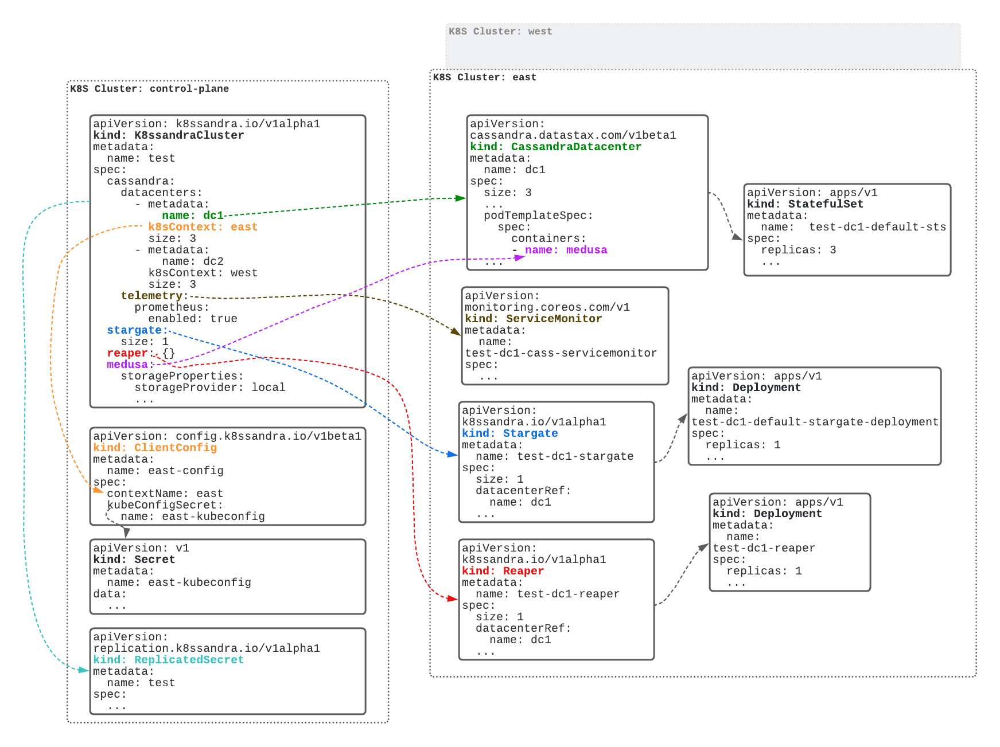

# K8ssandraCluster Components
K8ssandraCluster is the primary custom resource with which you will with interact when using K8ssandra Operator. This document provides a high level overview of the K8ssandraCluster custom resource. 

The following diagram highlights the key objects that comprise a K8ssandraCluster. The K8ssandraCluster spec is shown with highlighted parts pointing to corresponding objects.

# Kubernetes Clusters
The various components that make up a K8ssandraCluster can be spread across multiple Kubernetes clusters. One of those clusters must be designated as the control plane cluster. The other clusters are data plane clusters. In the diagram we have three Kubernetes clusters - `control-plane`, `east`, and `west`. The latter two make up the data plane.

The K8ssandraCluster object must be created in the control plane cluster.

K8ssandra Operator is deployed in each cluster. The operator consists of several controllers. Some controllers, notably the K8ssandraCluster controller, only run in the control plane cluster. This is the main reason that the K8ssandraCluster object needs be created in the control plane cluster. 

# CassandraDatacenter
Here we discuss the `cassandra.datacenters` property which is an array. K8ssandra Operator creates a CassandraDatacenter for each element. 

Notice the `name: dc1` that is highlighted in green. This tells K8ssandra Operator to create a CassandraDatacenter named `dc1`. The green arrow in the diagram points to the CassandraDatacenter object. The `size` property declares that there should be 3 Cassandra nodes.

<!-- TODO: Add link to configuration doc when its available -->

Cass Operator manages the CassandraDatacenter. Note the arrow from the CassandraDatacenter to the StatefulSet `test-dc1-default-sts`. Cass Operator creates the StatefulSet. The StatefulSet controller, which is part of Kubernetes itself, creates the actual pods that run Cassandra.

## k8sContext
K8ssandra Operator creates `dc1` in the `east` cluster. The `k8sContext` property determines in which Kubernetes cluster the operator creates the CassandraDatacenter. If not specified the operator creates the CassandraDatacenter in the control plane cluster.

To understand what values can be specified for `k8sContext` we have to talk about ClientConfigs which are covered in the next section.

# ClientConfig
A ClientConfig is another custom resource provided by K8ssandra Operator; however, it is not part of a K8ssandraCluster. The operator learns about remote Kubernetes clusters from ClientConfig objects. They provide information necessary for the operator to create connections and manage objects in remote clusters.

The operator identifies remote clusters using the `contextName` property. The property is optional. If not specified, the operator uses the ClientConfig name to identify the remote cluster.

The arrow going from the `k8sContext` property to the ClientConfig object which has a `contextName` property represents an indirect relationship. Creating and managing ClientConfigs is separate and independent from managing K8ssandraClusters.

**Note:** See [Remote Cluster Connection Management][remote-k8s-access/README.md] for more information about ClientConfigs. 

# Telemetry
Next we look at the `cassandra.telemetry` property. When it is enabled, K8ssandra Operator creates a ServiceMonitor for each CassandraDatacenter.

**Note:** The ServiceMonitor custom resource is provided by [Prometheus Operator](https://github.com/prometheus-operator/prometheus-operator).

<!-- TODO: Add line to prometheus doc when https://github.com/k8ssandra/k8ssandra-operator/pull/333 is merged -->

# Stargate
K8ssandra Operator provides a Stargate custom resource. The `stargate` property configures Stargate for each CassandraDatacenter. 

**Note:** See [stargate.io](https://stargate.io/) to learn more abour Stargate.

<!-- TODO: Add link to configuration doc when its available -->

The diagram illustrates the `test-dc1-stargate` Stargate object that the operator creates in the `east` cluster. More precisely the K8ssandraCluster controller creates the Stargate object.

Note the arrow from `test-dc1-stargate` `test-dc1-default-stargate-deployment`. The Stargate controller creates this Deployment. The Deployment controller, which is part of Kubernetes itself, creates the actual pod that runs Stargate.

# Reaper
K8ssandra Operator provides a Reaper custom resource. The `reaper` property configures Reaper for each CassandraDatacenter. 

**Note:** See [cassandra-reaper.io](http://cassandra-reaper.io/) to learn more about Reaper.

<!-- TODO: Add link to configuration doc when its available -->

The diagram illustrates the `test-dc1-reaper` Reaper object that the operator creates in the `east` cluster. More precisely the K8ssandraCluster controller creates the Reaper object.

Note the arrow from the `test-dc1-reaper` Reaper object to the `test-dc1-reaper` Deployment object. The Reaper controller creates this Deployment. The Deployment controller, which is part of Kubernetes itself, create the actual pod that runs Reaper.

# Medusa
The `medusa` property configures Medusa for performing backups and restores of Cassandra. K8ssandra Operator modifies the CassandraDatacenter to include additional containers in Cassandra pods for performing backup and restore operations.

**Note:** See [https://github.com/thelastpickle/cassandra-medusa](https://github.com/thelastpickle/cassandra-medusa) to learn more about Medusa.

K8ssandra Operator provides the CassandraBackup and CassandraRestore custom reources for configuring backup/restore operations. See [Deploying Medusa](medusa/usage.md) for more information on working with these custom resources.

# ReplicatedSecret
K8ssandra Operator provides a ReplicatedSecret custom resource. The operator creates a ReplicatedSecret for each K8ssandraCluster. This object determines which secrets in the control plane cluster are replicated to the data plane clusters. The best example of this is the default superuser secret.

There is a superuser secret for each K8ssandraCluster. It can be created and provided by the user; otherwise, the operator generates a default one. The operator ensures that this secret is replicated to each of the data plane clusters.

<!-- TODO: Add link to secrets management doc when its available -->
 
