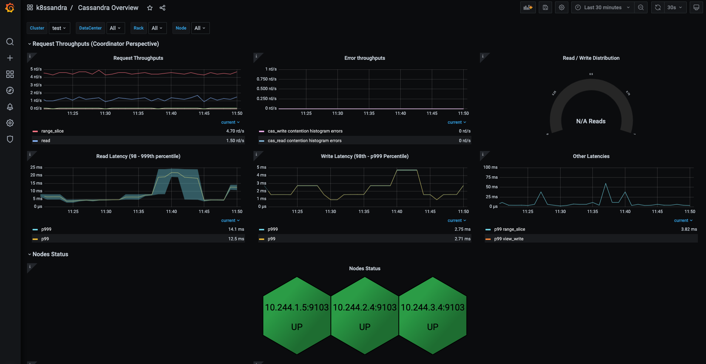

While K8ssandra v1 managed the deployment of the kube-prometheus stack, that ability was removed in k8ssandra-operator.  
The following guide will show you how to install Prometheus and Grafana on your Kubernetes cluster using the kube-prometheus-stack set of Helm charts.

## Prerequisites

The k8ssandra-operator should be installed in the `k8ssanda-operator` namespace.  
See the [installation documentation]() for more information.

## Installing and configuring the kube-prometheus-stack

`k8ssandra-operator` has integrations with Prometheus which allow for the simple rollout of Prometheus ServiceMonitors for Stargate, Cassandra and Reaper.
ServiceMonitors are custom resources of [prometheus-operator](https://github.com/prometheus-operator/prometheus-operator) which describe the set of targets to be scraped by Prometheus.
The prometheus-operator is a core component of the kube-prometheus-stack.

### Install the kube-prometheus-stack

We will install the kube-prometheus-stack in the same `k8ssandra-operator` namespace in order to simplify this guide.  
Create the following `kube-prom-stack-values.yaml` file:

```yaml
prometheus:
  prometheusSpec:
    serviceMonitorSelectorNilUsesHelmValues: false
    serviceMonitorSelector: {}
    serviceMonitorNamespaceSelector: {}
grafana:
  enabled: true
  adminUser: admin
  adminPassword: secret
  defaultDashboardsEnabled: false
  # -- Additional plugins to be installed during Grafana startup,
  # `grafana-polystat-panel` is used by the default Cassandra dashboards.
  plugins:
    - grafana-polystat-panel
  grafana.ini: {}
  image:
    repository: grafana/grafana
    tag: 7.5.11
    sha: ""
    pullPolicy: IfNotPresent
```

*Download this file [here](kube-prom-stack-values.yaml).*

Add the prometheus-community Helm repository:

```bash
helm repo add prometheus-community https://prometheus-community.github.io/helm-charts
helm repo update
```

Then, install the kube-prometheus-stack using the following command, and referencing the `kube-prom-stack-values.yaml` file:

```bash
helm install prometheus-grafana prometheus-community/kube-prometheus-stack -n k8ssandra-operator -f kube-prom-stack-values.yaml
```

This will install all the monitoring components in the `k8ssandra-operator` namespace.

### Creating a K8ssandraCluster with telemetry enabled

The following guide assumes k8ssandra-operator is already installed, and a K8ssandraCluster object was created with the following manifest, in the `k8ssandra-operator` namespace:

```yaml
apiVersion: k8ssandra.io/v1alpha1
kind: K8ssandraCluster
metadata:
  name: test
  namespace: k8ssandra-operator
spec:
  cassandra:
    serverVersion: "4.0.3"
    serverImage: k8ssandra/cass-management-api:4.0.3
    telemetry:
      prometheus:
        enabled: true
    storageConfig:
      cassandraDataVolumeClaimSpec:
        storageClassName: standard
        accessModes:
          - ReadWriteOnce
        resources:
          requests:
            storage: 1Gi
    config:
      jvmOptions:
        heapSize: 512M
    datacenters:
      - metadata:
          name: dc1
        size: 3
    mgmtAPIHeap: 64Mi 
  stargate:
    size: 1
    telemetry:
      prometheus:
        enabled: true
  reaper:
    keyspace: reaper_db
    telemetry:
      prometheus:
        enabled: true
```
*Download this manifest [here](k8ssandra.yaml).*

Setting `telemetry.prometheus.enabled` to `true` on the `.spec.cassandra`, `.spec.stargate` and `.spec.reaper` sections of the K8ssandraCluster CR will automatically create the ServiceMonitors.  
*Note: Reaper's telemetry block was added in K8ssandra v1.2.0 and Reaper v3.2.0.*  
  
You can selectively enable service monitor creation for each component without any requirement to enable them all.  
Wait for the pods to come up in the `k8ssandra-operator` namespace and fully start.

Running `kubectl get servicemonitor -n k8ssandra-operator` should return three ServiceMonitor resources once all the pods are up and running.  
You should get the following output:

```bash
% kubectl get servicemonitors -n k8ssandra-operator
NAME                                                 AGE
prometheus-grafana                                   7m41s
prometheus-grafana-kube-pr-alertmanager              7m41s
prometheus-grafana-kube-pr-apiserver                 7m41s
prometheus-grafana-kube-pr-coredns                   7m41s
prometheus-grafana-kube-pr-kube-controller-manager   7m41s
prometheus-grafana-kube-pr-kube-etcd                 7m41s
prometheus-grafana-kube-pr-kube-proxy                7m41s
prometheus-grafana-kube-pr-kube-scheduler            7m41s
prometheus-grafana-kube-pr-kubelet                   7m41s
prometheus-grafana-kube-pr-operator                  7m41s
prometheus-grafana-kube-pr-prometheus                7m41s
prometheus-grafana-kube-state-metrics                7m41s
prometheus-grafana-prometheus-node-exporter          7m41s
test-dc1-cass-servicemonitor                         5m47s
test-dc1-reaper-reaper-servicemonitor                5m47s
test-dc1-stargate-stargate-servicemonitor            5m47s
```

### Install the Grafana dashboards

Grafana will pick up dashboards passed as configmaps that have the label `grafana_dashboard: "1"`.  
Create the overview, condensed and stargate dashboards (download the manifest [here](grafana-dashboards.yaml)) configmaps:

```bash
kubectl apply -f grafana-dashboards.yaml -n k8ssandra-operator
``` 

You can port-forward the Grafana service to access the dashboard at [http://localhost:3000](http://localhost:3000): `kubectl port-forward svc/grafana-service 3000:3000`
Log in with the credentials defined in the values file: `admin` / `secret`

You should then see the following list of available dashboards:


Clicking on the Overview Dashboard should get you to a screen similar to this:


### Filtering metrics with MCAC

Cassandra provides a lot of metrics which can create some overload, especially when there are many tables in a cluster. [Filtering rules for MCAC](https://github.com/datastax/metric-collector-for-apache-cassandra/blob/master/config/metric-collector.yaml#L9-L72) can be defined in the telemetry spec:

```
apiVersion: k8ssandra.io/v1alpha1
kind: K8ssandraCluster
metadata:
  name: test
spec:
  cassandra:
    telemetry: 
      prometheus:
        enabled: true
        mcacMetricFilters:
          - "deny:org.apache.cassandra.metrics.Table"
          - "allow:org.apache.cassandra.metrics.Table.LiveSSTableCount"
```

When no filter is explicitly defined in the spec, default K8ssandra v1.x filters will be applied:

```
 - "deny:org.apache.cassandra.metrics.Table"
 - "deny:org.apache.cassandra.metrics.table"
 - "allow:org.apache.cassandra.metrics.table.live_ss_table_count"
 - "allow:org.apache.cassandra.metrics.Table.LiveSSTableCount"
 - "allow:org.apache.cassandra.metrics.table.live_disk_space_used"
 - "allow:org.apache.cassandra.metrics.table.LiveDiskSpaceUsed"
 - "allow:org.apache.cassandra.metrics.Table.Pending"
 - "allow:org.apache.cassandra.metrics.Table.Memtable"
 - "allow:org.apache.cassandra.metrics.Table.Compaction"
 - "allow:org.apache.cassandra.metrics.table.read"
 - "allow:org.apache.cassandra.metrics.table.write"
 - "allow:org.apache.cassandra.metrics.table.range"
 - "allow:org.apache.cassandra.metrics.table.coordinator"
 - "allow:org.apache.cassandra.metrics.table.dropped_mutations"
```

The above filtering rules don't apply to the new metrics endpoint introduced in v1.5.0.

### Filtering metrics with the new metrics endpoint from v1.5.0

The new metrics endpoint supports configuration override via a configmap, which can be used to define filtering rules through Prometheus relabeling rules:

```yaml
relabels:
  - sourceLabels: ["__tag1__", "__tag2__"]
    separator: ";"
    regex: "(.*);(b.*)"
    action: "drop"
  - sourceLabels: ["__tag1__", "__tag2__"]
    separator: ","
    regex: "^(a|b|c),.*"
    action: "drop"
```

## Next steps

* Explore other K8ssandra Operator [tasks]().
* See the [Reference]() topics for information about K8ssandra Operator Custom Resource Definitions (CRDs) and the single K8ssandra Operator Helm chart. 

