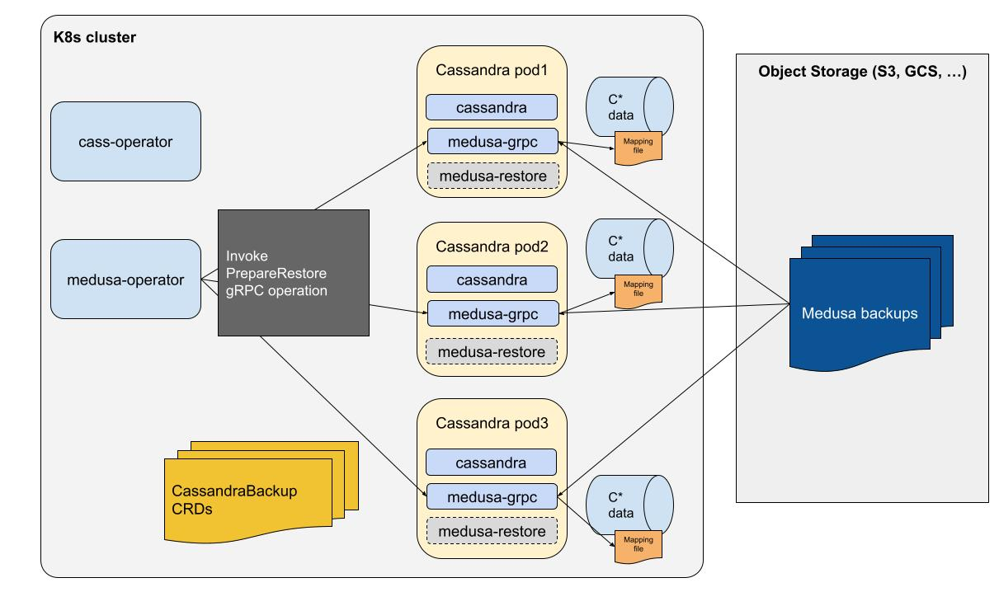
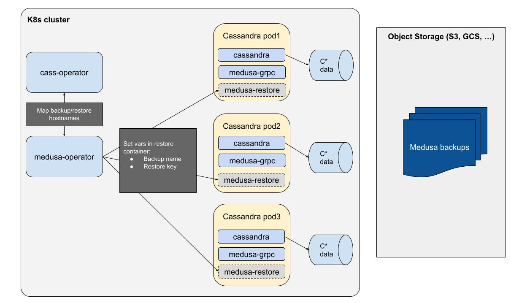

# Medusa Restore Controller - Remote restore support

## Background

The restore controller doesn’t yet support remote restores: restoring a backup to another cluster.
As we implement this feature, we would like to have it support multiple use cases that operators could expect to have working:

- Restoring a medusa-operator based backup to another Cassandra install in the same k8s cluster


- Restoring a medusa-operator based backup to another Cassandra install in a different k8s cluster


- Restoring a Medusa backup (non k8s) to a k8s Cassandra install


## Sync CassandraBackup resources with storage
The target solution will need to be able to sync the local CassandraBackup resources with the configured storage backend.
The sync should allow:

- Creating local missing resources from existing backups
- Deleting local resources for missing backups

The sync should be required explicitly, meaning that a new CRD should be created to request synchronization to the operator, and that CRD should contain a prefix so that a cluster can list backups stored for another cluster in a multi-tenant storage bucket.

The sync operation would:

- List the backups in the storage bucket, through a gRPC call
- Compare that list to the existing CassandraBackup resources
- Create a CassandraBackup object for each missing backup
- Delete local resources that don’t exist in the list of backups

Deletion of backups in the remote storage system isn't handled by the sync operation. It should be done through Medusa's purge operation.

## Medusa Tasks

Medusa related operations require orchestration and progress tracking. A new MedusaTask API was created for that need, implementing purge, sync and restore preparation in the initial version.
The MedusaTask controller takes care of scheduling the operations on pods that are required to run it (sync for example a single pod is required for sync operations but purge has to run on all pods). It also tracks the execution and updates the status of MedusaTask objects accordingly.

## Medusa changes
The tokenmap generated by Medusa is augmented to provide the placement of nodes in the cluster: datacenter and rack.
Currently Medusa is not dc/rack aware and it can probably be fairly surprising to users. It was built to backup a single DC per cluster and didn’t account for racks either.  
Restoring from a DC/rack aware cluster to another one imposes some constraints on the source/target nodes mapping, which are currently impossible to deal with safely in a remote restore: 

When using NetworkTopologyStrategy, the placement of replicas is dependent on the DC and rack layout.
In this context, the replica for a token range will be placed on the node that owns the next token range in the next rack.
We can't restore any node to any other node as we may end up putting several replicas in the same rack, and the nodes we'd restore to would possibly end up not containing data they're supposed be replica for.
We can be rigid about the mapping and expect the same dc and rack names exclusively, or do a 1:1 mapping between DCs/Racks despite having different names (but expect the same number of both).


## Restore Orchestration

1. Get backup definition from storage backend
    
  The restore operation will assume the CRDs have been synced with the remote storage backend. Backup topology (hostnames and tokens) will be retrieved from the new CRD format.

2. Prepare the restore

	A new PrepareRestore operation was created in Medusa's gRPC server. This operation will use Medusa's cluster restore orchestration methods (from `restore_cluster.py`) to compute the mapping between the backup and target nodes. This operation compares the tokenmaps, checks if the topologies match to decide whether or not an in place restore is performed, and then maps nodes 1:1 by ordering them by first token.
  The results of this mapping is stored under `/var/lib/cassandra/.restore_mapping/<restore key>`.
  This restore preparation is orchestrated using a MedusaTask.
  The mapping file looks as follows:

  ```
  {
    "in_place": false,
    "host_map": {
        "172.24.0.6": {
            "source": [
                "10.64.7.48"
            ],
            "seed": false
        },
        "172.24.0.3": {
            "source": [
                "10.64.1.60"
            ],
            "seed": false
        },
        "127.0.0.1": {
            "source": [
                "10.64.6.59"
            ],
            "seed": false
        }
    }
}
  ```



3. Alter the `system_auth` keyspace and repair it for remote restores

	Remote restores will require to keep the existing `system_auth` keyspace so that existing credentials can be retained. As token ownership will change, auth data could become unavailable after the restore. To avoid this and as preliminary step to a remote restore, the `system_auth` keyspace should be altered to be replicated on all nodes in the cluster and be repaired.
  Repair will require to be added to the supported operations of CassandraTask in cass-operator.

4. Set the env variables on the restore containers
  

  The init containers will get the following env variables set:

  - Backup name
  - Restore key

  These values will then be used to invoke medusa.restore_node in the medusa-restore init container.
  The restore key is used to allow marking the restore as done and avoid re-processing it upon restart, as well as getting the right mapping information in the file generated by the prepare operation.
  

5. Shutdown Cassandra to trigger the restore
  

  medusa-operator will patch the cassandradatacenter spec to trigger a shutdown of the Cassandra nodes through cass-operator. The pods will be restarted and the medusa-restore init container will trigger the restore.

6. Restore the backups

  
  
  The init-container will read the mapping file generated by the restore preparation phase, where the local node is identified as `127.0.0.1`.  
  This allows to know which fqdn will be enforced on the pod to restore the right backup. The mapping file also indicates if the restore should be done in place or in a remote fashion.
  In case the restore is identified as remote, the following will happen:  

  - system.local and system.peers will not be restored
  - auto_bootstrap will be set to false and seed nodes will start first
  - tokens will be enforced by modifying cassandra.yaml

  medusa-operator will monitor the restore by checking the cassandradatacenter object state.

  

  Once the cassandradatacenter is in Ready state, the restore will be marked as finished and the cluster will be fully restored and available.

## CassandraBackup CRD changes
CassandraBackup resources won't store the CassandraDatacenter spec anymore in their status, which is not used to perform a restore.
A `CreatedBySync` field is added so that backup objects created by a sync can be identified and the backup operation bypassed in the reconcile loop.

## CassandraRestore CRD changes
There's a new `PrepareRestore` operation that needs to be tracked in the restore controller. A new `RestorePrepared` boolean in the CassandraRestore status struct will be added to know if the step was done already and should be skipped during reconciles.

## Other required changes

**The cassandradatacenter object will not be recreated during restore.**
Currently the remote restore procedure assumes that the Cassandra cluster is not running and that the cassandradatacenter object hasn’t been created.
This is a problem because creating the cassandradatacenter shouldn’t predate the helm install which includes other components (Reaper, monitoring, …) that will not be restored by Medusa.
The new procedure will assume that a cassandradatacenter has been created already using the same number of nodes (token assignments can be different and will be enforced, datacenter name can differ). 


**The Restore chart should allow overriding the prefix of the storage backend.**
The remote cluster needs to be able to read from the backup storage bucket and point to the right folder in case multi-tenancy is enabled, despite using a different namespace name.

