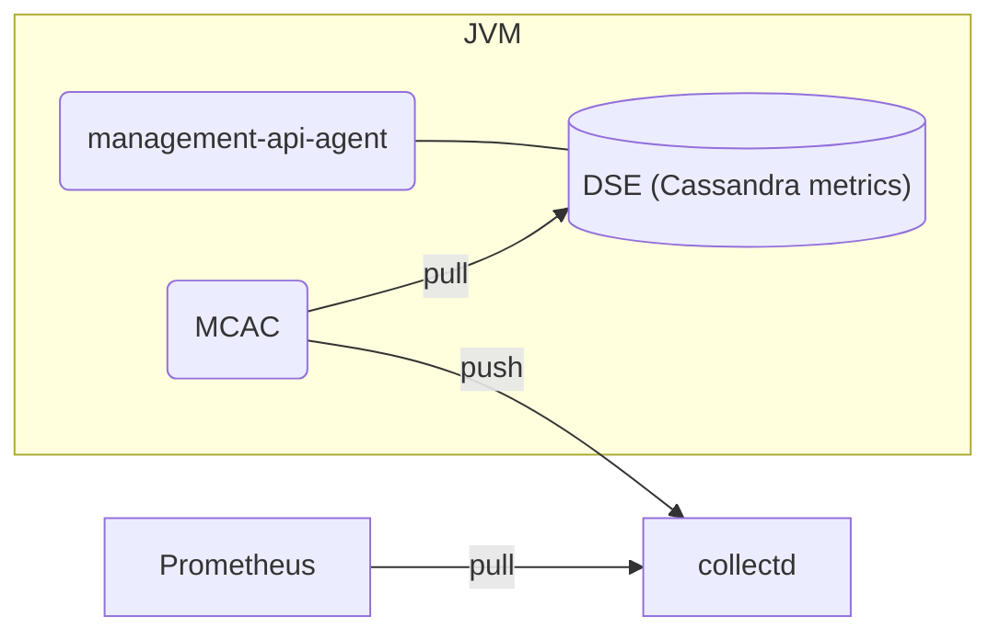
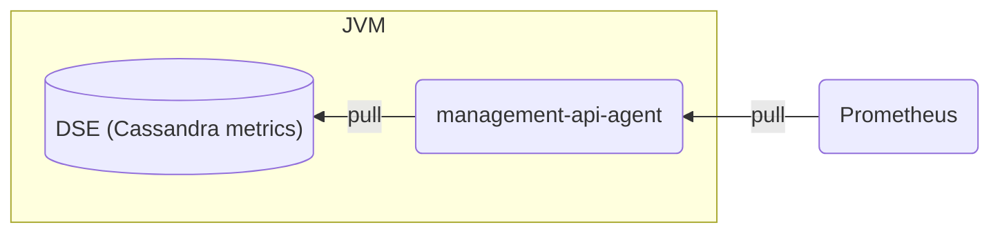

# MCAC replacement in the K8ssandra images

## Metrics pipeline

### MCAC



### Replacement



## Configuration changes

* Metric refresh interval is configured by the scraping system, not in the mcac settings
* Metrics are read from Cassandra when the scraping happens, where as MCAC read them in the background at different times than the scraping. This provides the most up-to-date metrics to the scraping system as well as allows to reduce/increase the metrics refresh times just by scraping more often/less often.
* No high/low water mark settings
* No storage configuration

## Non-operational changes

* Reduced CPU consumption
* Reduced GC load
* Supports larger amount of metrics without issues (tested with 8000 tables with table metrics enabled, no issues)
  * On my laptop, a single CPU core is able to process with profiling enabled:
    * 3M metrics / second with half of them being histograms (24 million datapoints)
    * 23M metrics / second if all of them are gauges (23 million datapoints)
  * A single Cassandra table generates around 246 datapoints
  * Prometheus / Victoria Metrics scraping, storage and processing is more likely to be the bottleneck

## Changes from MCAC from scraping POV

### No more machine level metrics

As this is designed to be run in the container, it made no sense to fetch machine level CPU/memory metrics here. Instead, that behavior should fall to some other plugin, such as node_exporter.

### Metric naming and structure changes

Currently MCAC outputs the metrics from its pipeline in a format supported by collectd, and not as Prometheus native format. For example, the histogram has different metric name for each quantile:

```
collectd_mcac_histogram_count_total{mcac="org.apache.cassandra.metrics.keyspace.validation_time.system",instance="192.168.1.179",mcac_filtered="true",cluster="TestCluster",dc="datacenter1",rack="rack1"} 0 1669980838205
collectd_mcac_histogram_p50{mcac="org.apache.cassandra.metrics.keyspace.validation_time.system",instance="192.168.1.179",mcac_filtered="true",cluster="TestCluster",dc="datacenter1",rack="rack1"} 0 1669980838205
collectd_mcac_histogram_p999{mcac="org.apache.cassandra.metrics.keyspace.validation_time.system",instance="192.168.1.179",mcac_filtered="true",cluster="TestCluster",dc="datacenter1",rack="rack1"} 0 1669980838205
```

The new system outputs the same metric in the correct Prometheus format with quantiles being labels (the same way other client libraries do the summary format):

```
org_apache_cassandra_metrics_keyspace_validation_time_count{host="6cc2e5ce-e73f-4592-8d02-fd5e17a070e3",instance="127.0.0.1",cluster="Test Cluster",datacenter="datacenter1",rack="rack1",keyspace="system",} 0.0
org_apache_cassandra_metrics_keyspace_validation_time{host="6cc2e5ce-e73f-4592-8d02-fd5e17a070e3",instance="127.0.0.1",cluster="Test Cluster",datacenter="datacenter1",rack="rack1",keyspace="system",quantile="0.5",} 0.0
org_apache_cassandra_metrics_keyspace_validation_time{host="6cc2e5ce-e73f-4592-8d02-fd5e17a070e3",instance="127.0.0.1",cluster="Test Cluster",datacenter="datacenter1",rack="rack1",keyspace="system",quantile="0.75",} 0.0
org_apache_cassandra_metrics_keyspace_validation_time{host="6cc2e5ce-e73f-4592-8d02-fd5e17a070e3",instance="127.0.0.1",cluster="Test Cluster",datacenter="datacenter1",rack="rack1",keyspace="system",quantile="0.95",} 0.0
org_apache_cassandra_metrics_keyspace_validation_time{host="6cc2e5ce-e73f-4592-8d02-fd5e17a070e3",instance="127.0.0.1",cluster="Test Cluster",datacenter="datacenter1",rack="rack1",keyspace="system",quantile="0.98",} 0.0
org_apache_cassandra_metrics_keyspace_validation_time{host="6cc2e5ce-e73f-4592-8d02-fd5e17a070e3",instance="127.0.0.1",cluster="Test Cluster",datacenter="datacenter1",rack="rack1",keyspace="system",quantile="0.99",} 0.0
org_apache_cassandra_metrics_keyspace_validation_time{host="6cc2e5ce-e73f-4592-8d02-fd5e17a070e3",instance="127.0.0.1",cluster="Test Cluster",datacenter="datacenter1",rack="rack1",keyspace="system",quantile="0.999",} 0.0
```

Also, all metrics are themselves the metrics names, not a common metric type like in the MCAC. The labels include some additional parsed information, such as ``keyspace``and ``table`` and they're not part of the metric name.

If the previous MCAC metrics don't look familiar, it can be because of metric relabeling rules which change the name of the metrics before they're ingested, but that happens outside MCAC in the Prometheus / Victoria Metrics scraper in that case. Nothing prevents writing similar rules in the future.

### Metrics filtering changes

The design of metric filtering should support logic that allows filtering based on the tags as well as metric names. The original MCAC didn't understand any structure of the Cassandra metrics, it only pushed stuff as collectd names and that's it. And that's part of the reason why MCAC metrics don't work well in Prometheus for complex queries (or large amounts of data).

This mimics the ``ServiceMonitor`` 's metricRelabing structure as it is familiar to Kubernetes devs. I've only implemented keep/drop as it does, but kept the semantics the same. That is, you could in theory copy existing Prometheus relabel rules for keep/drop and put them directly to the collector config. User does not need to learn anything new if they've used Prometheus previously.

The only difference could be a different Regexp engine in Java and Go. Order of the filters does not make any difference to processing. 

The configuration yaml ends up looking like (this is from my personal test, drops all metrics targeting a single table):

```yaml
filters:
  - source_labels: ["table"]
    separator: "@"
    regex: ".+"
    action: "drop"
```

The configuration file is read by default from /configs/metric-collector.yaml, but can be modified with Java property ``collector-config-path``, for example:

```sh
REVISIT_ROOT=/Users/michael.burman/projects/datastax/mcac-revisit
JVM_OPTS="$JVM_OPTS -javaagent:${REVISIT_ROOT}/build/libs/mcac-revisit-1.0-SNAPSHOT-all.jar -Dcollector-config-path=/Users/michael.burman/projects/datastax/apache-cassandra-4.0.4/conf/metric-collector.yaml"
```

This is similar to how MCAC was configured. Alternatively, we can add a system env also as a possibility.

The filtering has all the available labels, such as host (hostId), cluster, instance (pod_name), datacenter, rack, keyspace and table. In addition, I've also added (just like Prometheus) some internal ones for filtering that do not appear in the output: ``__name__`` for the metric name and ``__origname__`` to target the Cassandra's internal metric name. I do not recommend using the last one, but it's there if someone really wants to have weird outputs. 

The filtering itself happens on metric registration level, not at the query / update time, so it's a one time process. 
